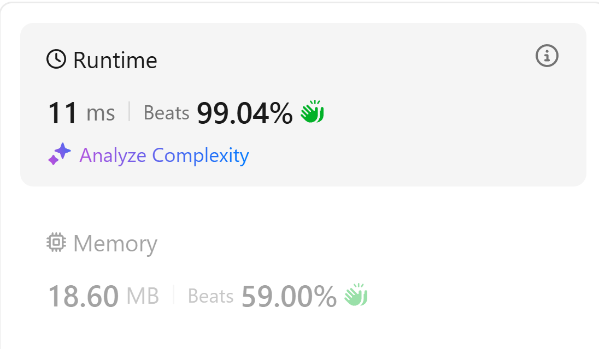
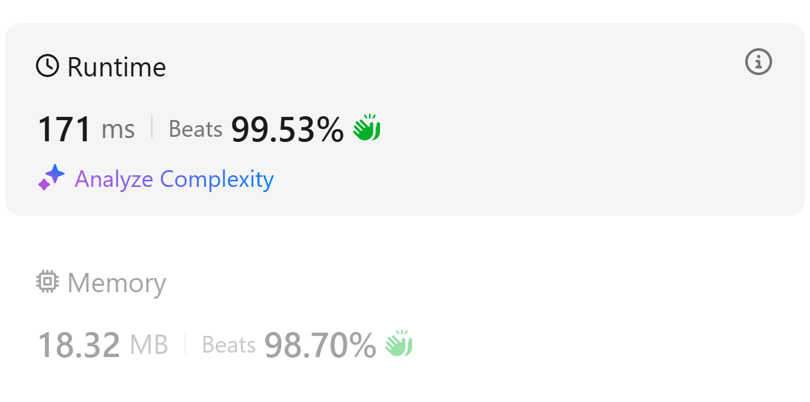

# 算法学习日记

有一些非常有趣、值得思索和探讨的算法技巧，不记录下来感觉很可惜！所以在本日志中，我将记录那些在我学习算法过程中遇到的令我难忘的算法题或算法技巧。

本日记为倒序排序，最上方的为最新的。

#### 串联所有单词的子串：滑动窗口优化

2025年7月30日 下午 

原题目：[LeetCode 30. Substring with Concatenation of All Words](https://leetcode.com/problems/substring-with-concatenation-of-all-words/)

这道题比较简单的一点是所有的单词长度都是一样的，所以我们只需要把和所有单词总长一样的窗口构建出来，然后判断窗口内的单词是否合格。在滑动窗口的时候，我们可以只移动一个单词的长度。

算法思路如下：

1. 构建一个hashmap存储已知单词信息；一个cur_hashmap存储窗口信息
2. 构建一个左指针L，记录单词长度为length，L分别从length的不同位置出发
3. 构建一个右指针R，代表窗口的结束，R从L出发的位置出发
4. 滑动R，以length为步长，每当一个单词滑入时：
   1. 判断单词是否在已知hashmap中，如果不在，当前窗口作废
   2. 如果在，判断当前窗口和已知hashmap是否一致，一致的话就记录L

整体思路非常简单和清晰，但是如果直接去对比cur_hashmap和hashmap的话，会牺牲很多时间。在此基础上，我们可以对滑动窗口时判断进行优化。

我们可以设置一个valid_count，当且仅当新滑入窗口的单词new_word在hashmap中的时候，我们增加valid_count的计数；当且仅当cur_hashmap[new_word]超过hashmap[new_word]的时候，我们固定R，收缩L，直到cur_hashmap[new_word]==hashmap[new_word]。

在我们收缩窗口的时候，当且仅当左边扔出去的单词left_word不是new_word的时候，我们才减少valid_count。

最后，如果valid_count == target_valid_count（也就是hashmap中单词的总数），我们就给结果加一。

**代码实现如下：**

```python
class Solution:
    def findSubstring(self, s: str, words: List[str]) -> List[int]:
        if not words:
            return []

        hashmap = {}
        target_valid_count = 0
        for word in words:
            target_valid_count += 1
            hashmap[word] = hashmap.get(word, 0) + 1
        length = len(words[0])
  
        result = []
        cur_hashmap = {}
        L = 0
        for i in range(length):
            cur_hashmap.clear()
            valid_count = 0
            L = i

            valid_count = 0
            for R in range(i, len(s), length):
                new_word = s[R:R+length]
                if new_word not in hashmap:
                    L = R+length
                    valid_count = 0
                    cur_hashmap.clear()
                else:
                    cur_hashmap[new_word] = cur_hashmap.get(new_word, 0) + 1
                    if cur_hashmap[new_word] <= hashmap[new_word]:
                        valid_count += 1
                    else:
                        while cur_hashmap[new_word] > hashmap[new_word]:
                            left_word = s[L:L+length]
                            cur_hashmap[left_word] -= 1
                            L += length
                            if left_word != new_word:
                                valid_count -= 1
                    if valid_count == target_valid_count:
                        result.append(L)
  
        return result
```

**AC表现如下：**

{style="display:block; margin:auto; width:400px;"}

#### 单词搜索II的四重剪枝

2025年7月30日 凌晨 

原题目：[LeetCode 212. Word Search II](https://leetcode.com/problems/word-search-ii/)

**优化一：找到单词后从Trie中移除技巧：**

在DFS中，当找到一个单词后（if node.word is not None:），除了将它加入结果集，还要立即执行 node.word = None。

这样做可以：

* 防止重复：避免从不同路径找到同一个棋盘位置上的单词时重复添加。
* 轻微加速：后续DFS再经过此节点时，不会重复执行 add 操作。

**优化二：Trie节点动态剪枝 (Dynamic Trie Node Pruning)**

技巧：在DFS回溯的过程中，如果一个Trie节点的所有子路径都已被探索完（即它的 children 字典变空），并且它自身也不再代表一个单词（node.word 已被设为 None），那么这个节点就成了无用节点，可以从其父节点中删除。

这样做可以动态地缩小Trie树的规模。后续从其他起点开始的DFS将不会再进入这些已被“榨干”价值的死胡同分支，从而减少冗余计算。这是对Trie地图本身的剪枝。

**优化三：邻接对预剪枝 (Adjacency Pre-Pruning)**

这算是一种启发式剪枝 (Heuristic Pruning)。

* 预处理：先遍历一遍board，将所有物理上相邻的字母对（如"oa", "an"）存入一个哈希集合 has。
* 过滤：在将 word 加入Trie树之前，检查该word中所有的字母对（如"oath"中的"oa", "at", "th"）。只要有一对（及其反向）不在 has 集合中，就说明这个word在物理上不可能构成，直接跳过，不加入Trie树。

在核心算法开始前，通过一个低成本的预处理，从源头上剔除大量无效的候选单词。如果测试数据中无效候选词很多，这个优化能带来数量级的性能提升。

**优化四：字符频率预剪枝 (Character Frequency Pre-Pruning)**

这是另一种强大的启发式剪枝。

* 预处理：统计board上每个字符的总数。
* 过滤：对于每个word，也统计其自身的字符频率。如果word需要的任何一个字符的数量超过了board能提供的总数，则直接跳过该word。

与优化三类似，也是在预处理阶段过滤无效单词。它对处理含大量重复字母的单词（如"banana"）特别有效。

**实现代码：**

```python
class TrieNode:
    def __init__(self):
        self.children = {}
        self.word = None

class Solution:
    def findWords(self, board: List[List[str]], words: List[str]) -> List[str]:
        trie = TrieNode()
        has = set()

        rows = len(board)
        cols = len(board[0])
        directions = [
            [0,1],[0,-1],[1,0],[-1,0]
        ]

        board_counts = Counter(c for row in board for c in row)

        for r in range(rows):
            for c in range(cols - 1):
                has.add(board[r][c] + board[r][c + 1])
        for r in range(rows - 1):
            for c in range(cols):
                has.add(board[r][c] + board[r + 1][c])

        for word in words:
            word_counts = Counter(word)
            if any(word_counts[char] > board_counts.get(char, 0) for char in word_counts):
                continue

            for i in range(len(word) - 1):
                a, b = word[i], word[i + 1]
                if a + b not in has and b + a not in has:
                    break
            else:
                curr = trie
                for char in word:
                    if char not in curr.children:
                        curr.children[char] = TrieNode()
                    curr = curr.children[char]
                curr.word = word

        result = []
        def tracking(i,j,root):
            cur_char = board[i][j]

            if cur_char not in root.children:
                return
        
            node = root.children[cur_char]

            if node.word is not None:
                result.append(node.word)
                node.word = None

            board[i][j] = '$'
            for dx, dy in directions:
                ni, nj = i + dx, j + dy
                if 0 <= ni < rows and 0 <= nj < cols and board[ni][nj] != '$':
                    next_char = board[ni][nj]
                    if next_char in node.children:
                        tracking(ni, nj, node)
                        child_node = node.children[next_char]
                        if not child_node.children: 
                            del node.children[next_char] 

            board[i][j] = cur_char

        for i in range(rows):
            for j in range(cols):
                cur_char = board[i][j]
                if cur_char in trie.children:
                    tracking(i,j,trie)

        return result
```

**AC表现如下：**

{style="display:block; margin:auto; width:400px;"}
